# 🔍 CivicLens

## AI-Powered Civic Issue Detection Platform

> Transform scattered civic complaints into actionable insights using Google AI

[](https://ai.google.dev/)
[](https://firebase.google.com/)
[](/)
[](LICENSE)

[](https://civic-cf6bf.web.app/)
<div align="center">
🌍 Experience the App Live

👉 https://YOUR-PROJECT-ID.web.app

</div>
---

## 📋 Problem Statement

Local civic and campus complaints are **scattered, unstructured, and difficult to analyze**. Authorities and administrators react late because they lack:
- 🕐 Real-time insights
- 📈 Trend detection
- 🎯 Issue prioritization
- 🗺️ Geographic visualization

## 💡 Solution

**CivicLens** is a web platform that uses **Google AI** to:
- ✅ Analyze civic complaints instantly
- ✅ Classify issues by category
- ✅ Detect sentiment and urgency
- ✅ Visualize hotspots on an interactive map
- ✅ Generate actionable recommendations

---

## 🖼️ Screenshots

| Dashboard | AI Analysis | Map View |
|-----------|-------------|----------|
| Modern dark-themed interface | Real-time Gemini-powered insights | Interactive Google Maps visualization |

---

## 🛠️ Google Technologies Used

| Technology | Purpose |
|------------|---------|
| **Google Gemini API** | AI-powered text analysis, categorization, sentiment detection |
| **Leaflet.js** | Interactive map library for issue visualization |
| **OpenStreetMap + CARTO** | Free, open-source map tiles and styling |
| **Firebase Hosting** | Production deployment with global CDN |
| **Firestore** | Complaint data persistence |

---

## 🚀 Quick Start

### Prerequisites
- Node.js 18+ (for local development)
- Google Cloud account (for API keys)
- Firebase CLI (for deployment)

### 1. Clone & Setup

```bash
git clone https://github.com/kenil-gopani/Civic-issue.git
cd Civic-issue
npm install
```

### 2. Configure API Keys

Edit `public/js/config.js`:

```javascript
const CONFIG = {
    GEMINI_API_KEY: 'your-gemini-api-key',      // Get from: https://makersuite.google.com/app/apikey
    MAPS_API_KEY: 'your-google-maps-api-key',   // Get from: https://console.cloud.google.com/
    DEMO_MODE: false,  // Set to true for demo without APIs
};
```

**Note:** Leaflet with OpenStreetMap tiles is free and doesn't require an API key! 🎉

### 3. Run Locally

```bash
npm run serve
```

Open: http://localhost:3000

### 4. Deploy to Firebase

```bash
# Install Firebase CLI
npm install -g firebase-tools

# Login to Firebase
firebase login

# Deploy
firebase deploy
```

---

## 📁 Project Structure

```
civiclens/
├── 📂 public/
│   ├── 📄 index.html          # Main HTML page
│   ├── 📂 css/
│   │   └── 📄 styles.css      # Modern dark theme styles
│   ├── 📂 js/
│   │   ├── 📄 config.js       # API configuration
│   │   ├── 📄 gemini.js       # Gemini API integration
│   │   ├── 📄 maps.js         # Google Maps integration
│   │   └── 📄 app.js          # Main application logic
│   └── 📂 assets/
│       └── 📄 logo.svg        # Brand logo
├── 📄 firebase.json           # Firebase Hosting config
├── 📄 .firebaserc             # Firebase project config
├── 📄 firestore.rules         # Firestore security rules
├── 📄 package.json            # Project metadata
└── 📄 README.md               # This file
```

---

## 🎯 Demo Flow

```mermaid
graph LR
    A[🌐 Open Website] --> B[📝 Enter Complaint]
    B --> C[🤖 Click Analyze]
    C --> D[📊 View AI Results]
    D --> E[🗺️ See on Map]
    E --> F[💡 Get Recommendations]
```



1. **Open Website** → Beautiful landing page explains the problem
2. **Enter Complaint** → Type or use sample complaints
3. **Click "Analyze"** → AI processes in real-time
4. **View Results** → Category, sentiment, urgency, summary
5. **See on Map** → Issue location appears on interactive map
6. **Read Insights** → Actionable recommendations provided

---

## 🔑 Getting API Keys

### Google Gemini API
1. Go to [Google AI Studio](https://makersuite.google.com/app/apikey)
2. Click "Create API Key"
3. Copy and add to `config.js`

### Google Maps API
1. Go to [Google Cloud Console](https://console.cloud.google.com/)
2. Create a new project or select existing
3. Enable "Maps JavaScript API"
4. Create credentials → API Key
5. Copy and add to `config.js` and `index.html`

---

## ⚡ Features

### 🤖 AI Analysis (Gemini)
| Feature | Description |
|---------|-------------|
| **Category Detection** | Infrastructure, Safety, Sanitation, Utilities, etc. |
| **Sentiment Analysis** | Positive, Neutral, Negative |
| **Urgency Assessment** | Low, Medium, High, Critical |
| **Smart Summary** | Concise issue description |
| **Recommendations** | Actionable next steps |

### 🗺️ Map Visualization (Leaflet + OpenStreetMap)
- Dark theme with CARTO tiles
- Color-coded urgency markers
- Category filtering
- Interactive popups
- No API key required - completely free!

### 🎮 Demo Mode
Set `DEMO_MODE: true` in config to:
- Run without API keys
- Use smart mock responses
- Perfect for presentations

---

## 📱 Responsive Design

| Device | Support |
|--------|---------|
| 🖥️ Desktop (1200px+) | ✅ Full experience |
| 📱 Tablet (768px - 1199px) | ✅ Optimized layout |
| 📱 Mobile (< 768px) | ✅ Touch-friendly UI |

---

## 🏆 Hackathon Submission

This project was built for the **Google AI Hackathon** demonstrating practical use of:
- 🧠 Google Gemini for intelligent text analysis
- 🗺️ Leaflet + OpenStreetMap for geographic visualization
- 🔥 Firebase for production hosting
- 💻 Modern web development best practices

---

## 🤝 Contributing

Contributions are welcome! Please feel free to submit a Pull Request.

1. Fork the repository
2. Create your feature branch (`git checkout -b feature/AmazingFeature`)
3. Commit your changes (`git commit -m 'Add some AmazingFeature'`)
4. Push to the branch (`git push origin feature/AmazingFeature`)
5. Open a Pull Request

---

## 📄 License

This project is licensed under the MIT License - see the [LICENSE](LICENSE) file for details.

---

## 🙏 Acknowledgments

- [Google AI](https://ai.google.dev/) for Gemini API
- [Leaflet](https://leafletjs.com/) for interactive maps
- [OpenStreetMap](https://www.openstreetmap.org/) contributors for map data
- [CARTO](https://carto.com/) for beautiful dark map tiles
- [Firebase](https://firebase.google.com/) for hosting infrastructure

---

<div align="center">

**Built with ❤️ for smarter cities**

[⭐ Star this repo](https://github.com/kenil-gopani/Civic-issue) • [🐛 Report Bug](https://github.com/kenil-gopani/Civic-issue/issues) • [💡 Request Feature](https://github.com/kenil-gopani/Civic-issue/issues)

</div>

